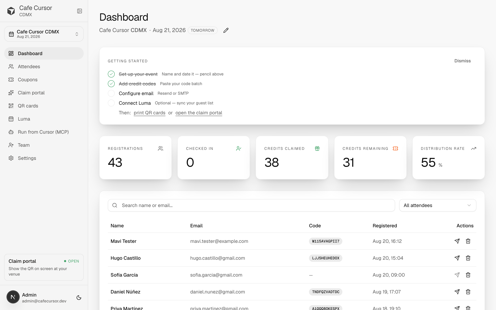
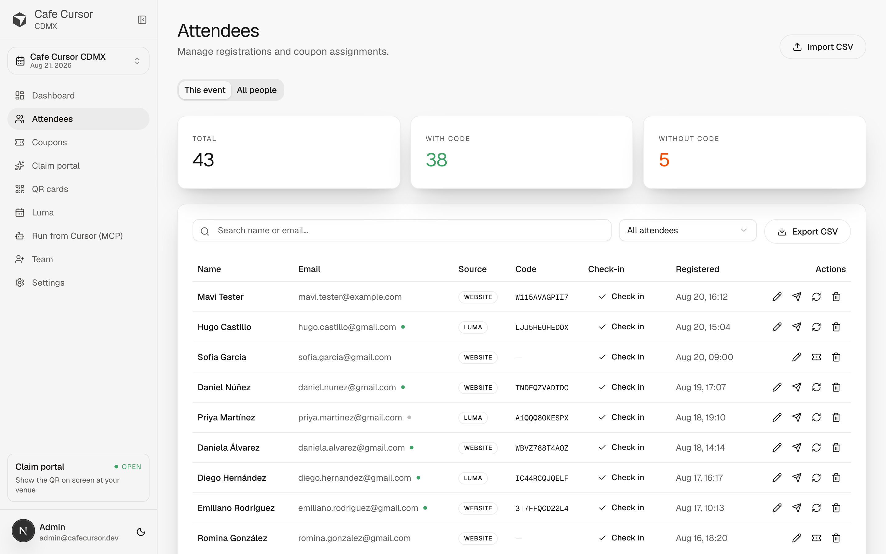
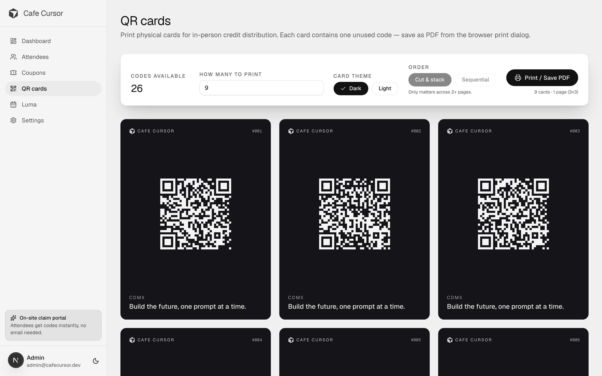
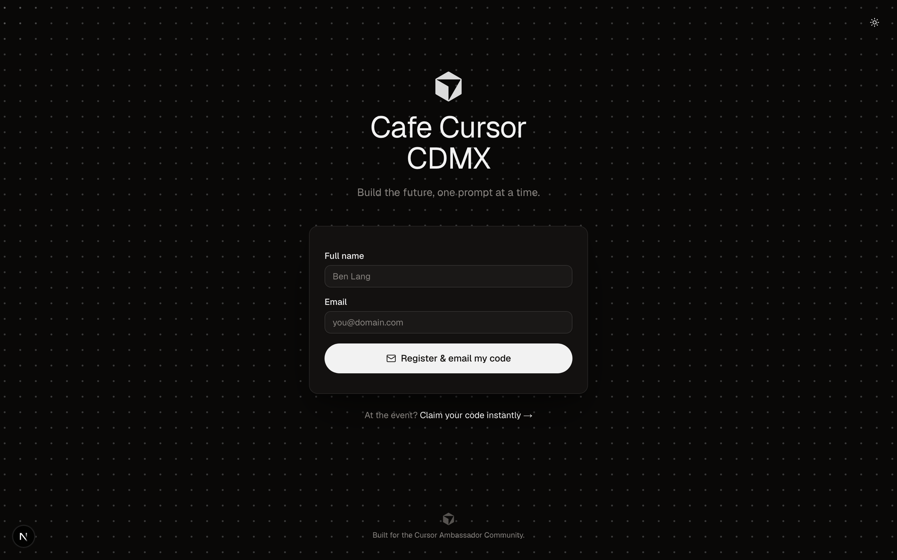

# Cafe Cursor

Event registration + Cursor credit distribution for community meetups. One
deployment per city. Built by and for the
[Cursor Ambassador Community](https://cursor.com/ambassadors) — see also the
[community hub](https://cursor.com/community) and
[Cafe Cursor events on Luma](https://luma.com/cursorcommunity).

Want to bring Cafe Cursor to your city? [Request one here](https://anysphere.typeform.com/to/kyTtNu5Q).

## What it does

**For attendees** — Register at `/register` and get a Cursor credit code by
email, or `/claim` for instant on-screen delivery at the event.

**For ambassadors** — Admin dashboard to manage attendees, code inventory,
project a scannable claim portal on the venue screen, print branded QR
cards, sync Luma guest lists, and email codes in bulk.

## Use it from Cursor (MCP)

This deployment ships its own MCP server, so an ambassador can set up and
run an event by describing what they want instead of clicking through the
dashboard.

Add it to `~/.cursor/mcp.json` — there is no key to paste:

```json
{
  "mcpServers": {
    "cafe-cursor": {
      "url": "https://your-deployment.example.com/api/mcp"
    }
  }
}
```

Then hit **Connect** in Cursor. It opens your deployment's own sign-in page,
you log in with your **admin account** — the same email and password as the
dashboard — and approve the permissions.

> There is no "Sign in with Cursor" and no cursor.com account involved. This
> deployment is its own OAuth authorization server, and the access it issues
> is tied to your admin user here. Revoke it under **Settings → Connections**
> and that Cursor install stops working immediately.

Once connected:

> "Set up Cafe Cursor Bogotá for Sept 12, import these 80 codes, and tell me if I'm ready."

> "Sync Luma and email everyone their code."

> "Is Ana checked in? How many codes are left?"

Tools that send email or burn codes always show a dry-run projection first
and wait for you to confirm — those two things cannot be taken back.

**📖 [Full walkthrough at `/docs/cursor`](src/app/docs/cursor/page.tsx)** —
served by the app itself, so every deployment carries its own guide.

### Scripts and CI

Cron and CI have no browser, so they use a machine client instead:
**Settings → Connections → New machine client**, then exchange the secret
for a token.

```bash
curl -X POST https://your-deployment.example.com/oauth/token \
  -d grant_type=client_credentials \
  -d client_id=cc_client_... \
  -d client_secret=cc_secret_...
```

Machine clients are scoped like any other connection — give a nightly sync
read access only and it cannot email anyone.

## Screenshots

|  |  |
|---|---|
|  |  |
| **Dashboard** — live KPIs + recent registrations | **Attendees** — search, manage, CSV import |
|  |  |
| **QR cards** — printable, one code per card | **Register** — public, dual-themed, dot-grid backdrop |

## Tech stack

- Next.js 16 (App Router, React 19) + TypeScript
- libSQL / SQLite via Drizzle ORM + `@libsql/client` (one driver, local
  file or [Turso](https://turso.tech) remote)
- iron-session cookies + bcryptjs for admin auth
- shadcn/ui + Tailwind CSS v4
- Resend for transactional email
- Luma public API for event guest sync

---

## Quick start — local

Requires Node.js 18+.

```bash
npm install
npm run init       # generates .env.local with random secrets + creates the DB
npm run dev
```

Then open <http://localhost:3000/admin-register>, enter the setup phrase
printed by `npm run init` (also in `.env.local` as `ADMIN_SETUP_PHRASE`) to
create the first admin, and you're dropped into onboarding.

Deploying somewhere public? Set `ADMIN_SETUP_PHRASE` before the app goes
live — without it, whoever opens the site first becomes the admin.

Prefer manual steps? `npm run setup` creates `.env.local`, `npm run db:push`
creates the database tables.

### Try it with demo data

Want to see the dashboard full of attendees and codes without doing the
onboarding by hand?

```bash
npm run db:seed    # 42 attendees, 60 codes, a configured city — and a demo admin
```

It prints demo admin credentials (`admin@cafecursor.dev` / `cafecursor`) —
sign in at `/login`. Re-running it wipes and reseeds the demo data. Never run
it against a real database.

---

## Deploy

One command, three hosts. Full walkthroughs in [`DEPLOY.md`](./DEPLOY.md).

| Host | Button | DB mode |
|---|---|---|
| **Railway** *(recommended for non-devs)* | [](https://railway.com/new/template?template=https%3A%2F%2Fgithub.com%2Fricgarcas%2Fcafe-cursor-credits) | SQLite on persistent volume |
| **Vercel + Turso** | [](https://vercel.com/new/clone?repository-url=https%3A%2F%2Fgithub.com%2Fricgarcas%2Fcafe-cursor-credits&env=SESSION_PASSWORD,NEXT_PUBLIC_APP_URL,DATABASE_URL,DATABASE_AUTH_TOKEN) | Turso hosted libSQL |
| Fly.io | [See docs](./DEPLOY.md#3-flyio--for-the-sqlite-enthusiasts) | SQLite + Litestream |

After deploy:
1. Open the site — any URL redirects to `/admin-register` until the first
   admin is created.
2. Create the admin account (name + email + password). You're auto-logged in
   and sent to onboarding.
3. Add Cursor credit codes in bulk via **Codes → Bulk add**.
4. Attendees arrive via `/register` (email), `/claim` (on-screen), CSV
   import, or Luma sync.

---

## Routes

| Route | Who | Purpose |
|---|---|---|
| `/register` | Public | Register, code emailed |
| `/claim` | Public | On-site registration (asks for the venue passcode when the active event sets one), code on screen |
| `/login` | Admin/Host | Sign in |
| `/forgot-password` | Public | Request a reset link (emailed) |
| `/reset-password` | Public | Set a new password from a reset link |
| `/change-password` | Admin/Host | Change password (forced on first login for invited members) |
| `/admin-register` | Public | Bootstrap the first admin on a fresh install |
| `/onboarding` | Admin | First-run city setup |
| `/admin/dashboard` | Admin/Host | KPIs (incl. check-in), getting-started checklist, low-inventory + passcode banners, recent attendees |
| `/admin/attendees` | Admin/Host | Event lens + "All people" community lens; edit, reassign, check-in, CSV import/export |
| `/admin/coupons` | Admin | Shared code pool: bulk import, edit |
| `/admin/qr-cards` | Admin/Host | Print branded physical cards (city + event name) |
| `/admin/luma` | Admin/Host | Sync Luma events into the selected event and dispatch credits |
| `/admin/team` | Admin | Invite co-hosts (admin/host) with one-time passwords |
| `/admin/settings` | Admin | City, integrations, API keys |

Events are city-scoped: people and the coupon pool persist across events, while
each event tracks its own registrations, check-ins, and emails. Switch the
active/selected event from the sidebar event switcher.

**Lost admin password with no email configured?** Run
`npm run reset-password -- you@email.com` on the server — it prints a temporary
password and forces a change on next login.

## Project layout

```
src/
├── app/                 # Pages + API routes
├── components/
│   ├── admin/           # Admin feature components
│   ├── brand/           # Logo, wordmark
│   ├── onboarding/      # Wizard
│   ├── public/          # Public-page shell
│   └── ui/              # shadcn/ui primitives (don't modify)
├── lib/
│   ├── auth/            # iron-session + bcrypt helpers
│   ├── db/              # Drizzle schema + libSQL client
│   ├── emails/          # Resend templates
│   └── luma/            # Luma API client + sync
└── proxy.ts             # Guards /admin and /onboarding
```

## For AI agents

If you're an AI agent (Claude Code, Cursor, Codex, etc.) working on this
repo, start with [AGENTS.md](./AGENTS.md) — it's the canonical brief on
stack, conventions, and what not to do. [CLAUDE.md](./CLAUDE.md) adds a few
Claude-specific tips.

## Credits

Built for the [Cursor Ambassador Community](https://cursor.com/ambassadors).
Cursor is available at [cursor.com](https://cursor.com).

## License

[MIT](./LICENSE) — free to use, modify, and redistribute. Built for the
Cafe Cursor / Cursor Ambassador community, open to everyone.
